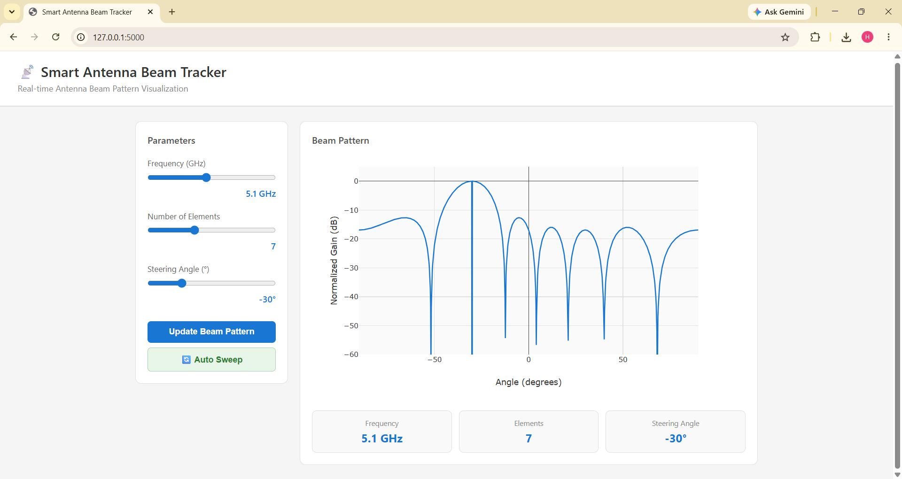

# 📡 Smart Antenna Beam Tracker

A real-time web application to visualize antenna beam patterns interactively, built with Python Flask, NumPy, and Plotly.

---

## 🔍 Overview

This project simulates how antenna arrays direct signals in specific directions. Users can control frequency, number of antenna elements, and steering angle to observe how the beam pattern changes in real time.

---

## ✨ Features

- 📊 Real-time beam pattern visualization using Plotly
- 🎛️ Interactive sliders for:
  - Frequency (1–10 GHz)
  - Number of antenna elements (2–16)
  - Steering angle (-60° to +60°)
- 🔄 Auto-sweep animation to simulate beam direction changes
- ⚡ Live graph updates on parameter change
- 🖥️ Clean and simple web interface

---

## 🛠️ Tech Stack

| Layer | Technology |
|-------|-----------|
| Backend | Python, Flask |
| Math & Signal Processing | NumPy |
| Visualization | Plotly |
| Frontend | HTML, CSS, JavaScript |

---

## 🚀 How to Run

**1. Clone the repository**
```
git clone https://github.com/PatilHrucha/smart-antenna-beam-tracker.git
cd smart-antenna-beam-tracker
```

**2. Install dependencies**
```
pip install flask numpy plotly
```

**3. Run the app**
```
python app.py
```

**4. Open in browser**
```
http://127.0.0.1:5000
```

---

## 📸 Screenshot



---

## 🎓 Concepts Used

- Antenna Array Factor (AF) calculation
- Phase steering using steering angle
- Signal normalization and dB conversion
- Real-time frontend-backend communication via REST API

---

## 👩‍💻 Author

**Hrucha Patil**
- GitHub: [@PatilHrucha](https://github.com/PatilHrucha)
- LinkedIn: [hrucha-patil](https://linkedin.com/in/hrucha-patil)
